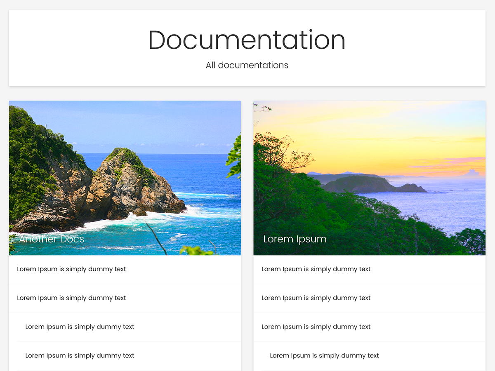

# weDocs Child Theme
weDocs Child Theme. weDocs is a documentation theme for WordPress.

Demo: [docs.wpbean.com](http://docs.wpbean.com/)

### How to Install 

As it's a child theme of weDocs, first you have to install the main parent weDocs theme. Go to the following link to download the weDocs parent theme. Also you are going to need the weDocs plugin.

* [weDocs Parent Theme](https://github.com/tareq1988/wedocs)
* [weDocs Plugin](https://wordpress.org/plugins/wedocs/)